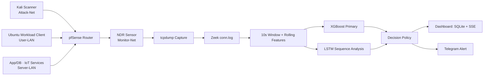

# AI 기반 네트워크 스캔 탐지 NDR 시스템 | 포트폴리오

## 한 줄 소개

VM Lab의 라우터 트래픽을 Zeek flow 로그로 변환하고, XGBoost 기반 1차 탐지와 LSTM 기반 시계열 분석을 결합해 일반 포트 스캔 및 low-and-slow scan을 분석하는 NDR 시스템을 설계·검증했습니다.

## 프로젝트 정보

| 항목 | 내용 |
| --- | --- |
| 기간 | 2026년 캡스톤디자인 |
| 소속 | 대전대학교 정보보안학과 캡스톤디자인 팀 디지털 혁명단 |
| 역할 | 팀장 |
| 핵심 기술 | Python, Zeek, tcpdump, XGBoost, LSTM, FastAPI, pfSense, Docker, SQLite, SSE |
| 구현 범위 | VM Lab · 데이터 파이프라인 · ML 모델 · 실시간 Sensor runtime · 대시보드 · Telegram 알림 |

## 문제 정의

일반 포트 스캔은 짧은 시간 동안 다수의 포트와 IP에 접근하므로 flow 수, 목적지 포트 수, 연결 실패율 같은 단일 window 통계로 포착할 수 있습니다. 반면 low-and-slow scan은 연결을 여러 시간 구간으로 분산해 단일 window에서는 정상 트래픽처럼 보일 수 있습니다.

이 프로젝트는 다음을 목표로 했습니다.

- 단일 window의 통계적 스캔 신호를 빠르게 탐지한다.
- rolling/sequence feature로 시간에 따라 축적되는 저속 스캔 신호를 확인한다.
- 데이터 누수와 과도한 성능 주장을 피하는 검증 절차를 설계한다.
- 모델 추론을 관제 화면과 알림까지 연결한다.

## 시스템 구조

실시간 Sensor는 60초 단위로 라우터 PCAP을 수집하고, 이를 Zeek 로그와 10초 window feature로 변환합니다. 실행(run) 전체의 rolling feature를 다시 계산한 뒤 XGBoost를 먼저 수행합니다. LSTM은 6개 window 이력이 쌓인 뒤부터 시계열 패턴을 분석합니다. 최종 이벤트는 `normal`, `warning`, `scanning` 상태로 Dashboard API에 전송됩니다.

## 내가 담당한 일

- 팀장으로서 문제 정의, 실험 범위, 시스템 아키텍처를 설계했습니다.
- Kali 공격자, Ubuntu 사용자, App/DB·IoT 서버, pfSense 라우터, NDR Sensor, Dashboard를 분리한 VM Lab을 구성했습니다.
- 공격/정상 트래픽 수집 시나리오와 Zeek `conn.log` 기반 데이터 처리 흐름을 설계했습니다.
- flow 규모, 목적지 다양성, 실패율, entropy, rolling statistics를 포함한 공통 feature schema를 구현했습니다.
- XGBoost와 LSTM을 중심으로 모델을 설계하고, GRU는 경량 비교군으로 평가했습니다.
- session/run group split, source-separated 평가, real-only/합성 데이터 비교로 데이터 누수와 성능 과장을 통제했습니다.
- 모델 추론 결과를 SQLite, Server-Sent Events, Telegram 알림으로 연결했습니다.
- 모델 번들 export, schema 검증, readiness audit를 자동화했습니다.

## 핵심 기술적 의사결정

| 의사결정 | 이유와 효과 |
| --- | --- |
| Raw IP를 모델 feature에서 제외 | 특정 장비/IP를 외우는 모델을 피하고, 접근 패턴 중심으로 일반화하기 위해 |
| Session/run 단위 group split | 같은 수집 세션의 유사 flow가 train/test에 동시에 들어가 성능이 과대평가되는 것을 방지 |
| XGBoost를 기본 판정으로 채택 | tabular feature에서 빠르게 추론하고 feature importance를 분석할 수 있어 Sensor runtime에 적합 |
| LSTM을 주력 시계열 모델로 선정 | 동일 데이터·feature·sequence 조건에서 GRU보다 전체 F1과 low-and-slow Recall이 높았기 때문 |
| XGBoost+LSTM 이중 구조 | 단일 window의 빠른 통계 판단과 6개 window의 장기 의존성 분석을 함께 사용하기 위해 |
| 실시간 수집과 화면 연동 | 오프라인 분류 성능이 아니라 분석자가 이벤트를 확인하고 대응할 수 있는 NDR 흐름을 만들기 위해 |

## 데이터와 모델

### 공통 feature schema

- 결합 실험 데이터: 178,059 rows, 107 columns, 90 model features
- 데이터 구성: 공개 데이터셋, 시뮬레이션, VM Lab 수집 데이터를 공통 Zeek flow schema로 정규화
- 핵심 feature: flow count, unique destination IP/port count, failed connection ratio, bytes/packets, protocol ratio, service/port/connection-state entropy
- 시간 feature: 6·12·30·60 window rolling statistics와 low-and-slow score

### 주력 모델 구조: XGBoost+LSTM

XGBoost는 모든 10초 window를 빠르게 판정하는 1차 모델이며, LSTM은 최근 6개 window의 누적 행동 패턴을 분석하는 주력 시계열 모델입니다. 포트폴리오의 최종 후보 구조는 두 확률 신호를 validation-selected threshold로 결합하는 **XGBoost+LSTM**입니다.

현재 공개 runtime은 GRU 추론 adapter를 포함합니다. LSTM 모델과 비교 코드·평가 산출물은 구현됐지만, XGBoost+LSTM의 score 결합 정책과 runtime adapter는 아직 통합 전입니다. 따라서 LSTM은 검증된 주력 시계열 모델로, GRU는 경량 비교 모델 및 기존 runtime 경로로 구분합니다.

## 검증 근거

### 1. Low-and-slow feature 효과

90개 feature와 6·12·30·60 window rolling feature를 사용한 scenario-time-blocked 검증에서, `low_slow_v2`는 v1 대비 false negative를 **28건 → 1건**, false positive를 **314건 → 4건**으로 줄였습니다.

다만 미래 시점 test block에 해당 공격군이 학습/검증 데이터에 전혀 없으면 성능을 일반화할 수 없습니다. 그래서 시나리오별 future-run holdout과 실제 정상 트래픽 수집을 후속 검증 조건으로 뒀습니다.

### 2. XGBoost·LSTM 모델 비교: 연구용 참고값

동일한 64,908개의 aligned tail-window test rows에서 비교한 결과입니다. XGBoost는 단일 window, LSTM은 6-window sequence를 입력으로 사용합니다. 공개·시뮬레이션 데이터가 섞인 cross-domain 실험이므로, 이 표를 실제 운영 환경의 성능으로 주장하지 않았습니다.

| 모델 | Accuracy | Precision | Recall | F1 | FPR |
| --- | ---: | ---: | ---: | ---: | ---: |
| XGBoost | 94.17% | 99.93% | 91.25% | 95.39% | 0.12% |
| LSTM | 99.53% | 99.67% | 99.62% | 99.64% | 0.65% |

LSTM은 같은 조건의 GRU보다 F1이 0.4552, Recall이 62.50%p 높았고, low-and-slow attack 1,160개에서 Recall 99.57%를 기록했습니다. XGBoost+LSTM은 빠른 통계적 판단과 장기 시계열 판단을 결합하는 최종 후보 구조입니다. 결합 점수와 threshold는 validation split에서 확정한 뒤 held-out test에 한 번만 적용할 계획입니다.

### 3. Controlled Lab XGBoost bundle

real-only run-group CV로 내보낸 XGBoost 모델 번들은 1,025 rows, 70 groups에서 feature schema·identity feature 부재·group overlap 부재를 점검했습니다. 통제된 Lab gate에서 Precision **1.0000**, Recall **0.9947**, F1 **0.9974**, FPR **0**을 기록했습니다.

이 수치는 정상/공격 시나리오가 통제된 Lab에서의 readiness evidence이며, 기업망 수준의 배포 성능이나 일반화 성능을 의미하지 않습니다.

## 구현 결과

- `tcpdump → Zeek → feature → inference → Dashboard`의 end-to-end NDR 흐름을 구성했습니다.
- Sensor가 `POST /api/events`로 전송한 이벤트를 Dashboard가 SQLite에 저장하고 SSE로 실시간 표시합니다.
- `scanning` 이벤트에 Telegram 알림을 연동했으며, 동일 source IP에는 cooldown을 적용했습니다.
- 모델 bundle의 feature schema, 모델 파일 hash, group-CV metric gate, real/synthetic 분리 평가 여부를 자동 점검했습니다.
- 정상 workload와 controlled scan을 분리해, 단순 공격 재생이 아닌 baseline 대비 탐지 흐름을 검증했습니다.

## 한계와 다음 단계

- 현재 데이터와 네트워크는 VM Lab 중심이므로 실제 기업망의 복잡한 정상 트래픽을 대변하지 않습니다.
- public dataset 성능은 cross-domain 참고값일 뿐, simulation/운영 성능과 합산하지 않습니다.
- XGBoost+LSTM의 최종 score 결합 정책과 runtime adapter는 아직 통합 전입니다.
- 실제 정상 트래픽을 추가 수집하고, lateral movement·brute force·C2로 탐지 범위를 확대해야 합니다.
- future-run holdout, threshold tuning, model drift 감지, 탐지 근거 설명 기능을 후속 과제로 둡니다.

## 포트폴리오 본문 예시

> **AI 기반 네트워크 스캔 탐지 NDR 시스템** — pfSense 기반 VM Lab에서 수집한 트래픽을 Zeek flow 로그로 변환하고, XGBoost 기반 1차 탐지와 LSTM 기반 시계열 분석으로 포트 스캔 및 low-and-slow scan을 분석하는 NDR 시스템을 설계·검증했습니다. 팀장으로서 VM 네트워크·수집 시나리오·90개 공통 feature schema·모델 평가·Sensor runtime·SQLite/SSE Dashboard·Telegram 알림을 설계했습니다. 특히 raw IP를 배제하고 session/run group split으로 데이터 누수를 통제했으며, 동일 조건 비교에서 LSTM이 GRU보다 높은 F1과 low-and-slow Recall을 보여 XGBoost+LSTM을 주력 후보 구조로 선정했습니다.

