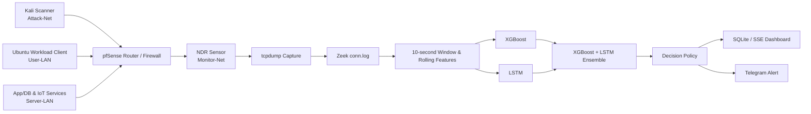

# AI 기반 네트워크 스캔 탐지 NDR 시스템

> VM Lab의 트래픽을 Zeek flow 로그로 변환하고, **XGBoost 단독 모델**과 **XGBoost+LSTM 앙상블 모델**로 포트 스캔 및 low-and-slow scan을 분석하는 NDR(Network Detection and Response) 프로젝트입니다.

## 프로젝트 개요

일반 포트 스캔은 짧은 시간에 다수의 연결을 발생시켜 단일 window 통계로 포착할 수 있습니다. 반면 low-and-slow scan은 연결을 여러 시간 구간에 분산하므로 단일 window에서는 정상 트래픽처럼 보일 수 있습니다. 이 프로젝트는 XGBoost의 빠른 window-level 판단과 LSTM의 시간적 패턴 분석을 앙상블해 이 문제를 다룹니다.

| 항목 | 내용 |
| --- | --- |
| 프로젝트 | AI 기반 네트워크 스캔 탐지 NDR 시스템 |
| 기간 | 2026년 캡스톤디자인 |
| 역할 | 팀장 · VM Lab 설계 · 데이터셋 구성 · Feature Engineering · 모델 개발 · 평가/발표 자료 구성 |
| 핵심 산출물 | 모델 번들, 실시간 분석 파이프라인, SQLite/SSE 대시보드, Telegram 알림 |

포트폴리오용 상세 문서는 [PORTFOLIO.md](PORTFOLIO.md)를 참고하세요.

## 아키텍처



## 데이터셋과 Feature Engineering

10개 데이터셋을 공통 schema `ndr_common_low_slow_v2`로 정규화하고 `session_id` 기준 group-aware split을 적용했습니다. 같은 session이 train/test에 동시에 포함되지 않게 해, 수집 세션을 외운 모델의 성능 과대평가를 줄였습니다.

| 항목 | 값 |
| --- | ---: |
| 전체 rows | 178,059 |
| 전체 columns | 107 |
| 모델 입력 feature | 90 |
| normal / attack | 112,021 / 66,038 |
| 데이터 구분 | real 162,059 / synthetic 16,000 |
| train / validation / test | 93,174 / 11,810 / 73,075 rows |

90개 feature는 22개 base feature와 68개 rolling feature로 구성됩니다.

| 범주 | 예시 |
| --- | --- |
| 기본 flow 통계 | `flow_count`, `avg_duration`, `avg_total_bytes` |
| 목적지 다양성 | `unique_dst_count`, `unique_dst_port_count` |
| 연결 품질 | `failed_conn_ratio`, `conn_state_entropy` |
| 프로토콜·서비스 | TCP/UDP/ICMP 비율, service/port entropy |
| 시간적 맥락 | `rolling_6/12/30/60_*`, `low_slow_scan_score` |

원시 source/destination IP와 metadata는 모델 입력에서 제외하고, 데이터 출처 추적·sequence 구성·평가 해석에만 사용합니다.

## 최종 모델

포트폴리오에서 제시하는 최종 모델은 LSTM 단독이 아니라 아래 두 가지입니다.

| 모델 | 입력 | 역할 |
| --- | --- | --- |
| XGBoost | 현재 10초 window의 `1 × 90` feature | 빠른 단일-window 탐지와 운영 기준선 |
| XGBoost+LSTM | XGBoost 확률 + 최근 6개 window의 LSTM 확률 | low-and-slow처럼 시간에 누적되는 공격 패턴 보완 |

```text
p_xgb  = XGBoost(x_t)                    # x_t: 1 × 90 feature
p_lstm = LSTM(x_(t-5), …, x_t)           # 6 × 90 feature sequence
p_ens  = α × p_xgb + (1 - α) × p_lstm

prediction = attack  if p_ens ≥ τ
```

XGBoost와 LSTM은 같은 tail window 기준으로 정렬한 뒤 결합합니다. 앙상블 가중치 `α`와 threshold `τ`는 validation split에서 선택하고 held-out test에는 한 번만 적용합니다. LSTM은 독립적인 최종 모델이 아니라 XGBoost+LSTM 앙상블의 시계열 구성 요소입니다.

## 평가

sequence/ensemble 비교는 64,908개의 aligned tail-window test rows에서 수행합니다. 아래 XGBoost 수치는 통합 데이터셋 문서에 기록된 단독 모델 결과입니다.

| 최종 모델 | Eval rows | Threshold | Accuracy | Precision | Recall | F1 | ROC-AUC | PR-AUC | FPR | FNR |
| --- | ---: | --- | ---: | ---: | ---: | ---: | ---: | ---: | ---: | ---: |
| XGBoost | 64,908 | 0.8000 | 94.17% | 99.93% | 91.25% | 0.9539 | 0.9985 | 0.9992 | 0.12% | 8.75% |
| XGBoost+LSTM | 64,908 aligned tail windows | 제출 결과 기준 | 99.51% | 99.77% | 99.49% | 0.9963 | 0.9995 | 0.9997 | 0.45% | 0.51% |

XGBoost+LSTM은 XGBoost 단독 대비 Recall을 91.25%에서 99.49%로 높이고 FNR을 8.75%에서 0.51%로 낮췄습니다. FPR은 0.12%에서 0.45%로 증가했으므로, 공격 미탐을 줄이는 대신 일부 오탐 증가를 감수하는 모델로 해석합니다. 기존 XGBoost+GRU 수치는 다른 앙상블의 결과이며, 이 표에는 사용하지 않았습니다.

## 실시간 파이프라인

```text
Router tcpdump → Zeek conn.log → 10초 window feature
→ rolling low-and-slow feature → XGBoost 확률
→ LSTM sequence 확률 → XGBoost+LSTM ensemble
→ Normal / Warning / Scanning → Dashboard / Alert
```

현재 공개 runtime은 XGBoost+GRU 추론 adapter를 포함합니다. LSTM 모델·비교 코드·평가 산출물은 준비되어 있으나, XGBoost+LSTM의 score 결합 정책과 runtime adapter는 아직 통합 전입니다. 이 README는 XGBoost+LSTM을 포트폴리오의 목표 모델 구조로 소개하며, runtime이 이미 해당 앙상블로 교체됐다고 주장하지 않습니다.

대시보드는 Sensor VM의 `POST /api/events`를 SQLite에 저장하고 Server-Sent Events로 브라우저에 전달합니다. `scanning` 이벤트는 source IP별 cooldown이 적용된 Telegram 알림을 지원합니다.

## 공개 범위와 한계

- 원시 PCAP·데이터셋·실제 설정·비밀 값·학습 모델은 공개 저장소에서 제외합니다.
- 공개 데이터/시뮬레이션 결합 성능은 cross-domain 참고값이며 실제 기업망 성능으로 일반화하지 않습니다.
- XGBoost+LSTM의 최종 앙상블 지표와 runtime adapter는 추가 검증·통합이 필요합니다.
- 실제 정상 트래픽 확대 수집, future-run holdout, threshold tuning, drift 감지를 후속 과제로 둡니다.

## 기술 스택

| 구분 | 기술 |
| --- | --- |
| Language / ML | Python, XGBoost, LSTM, scikit-learn |
| Network | Zeek, tcpdump, pfSense, Nmap |
| Infrastructure | VMware, Docker, Ubuntu, Debian, Kali Linux |
| Serving | FastAPI, SQLite, Server-Sent Events, Telegram |

## Sources

- [Notion — 데이터셋 관련 페이지](https://app.notion.com/p/37a4b27666b0806d9b42f28e41465200) (작업공간 권한 필요)

