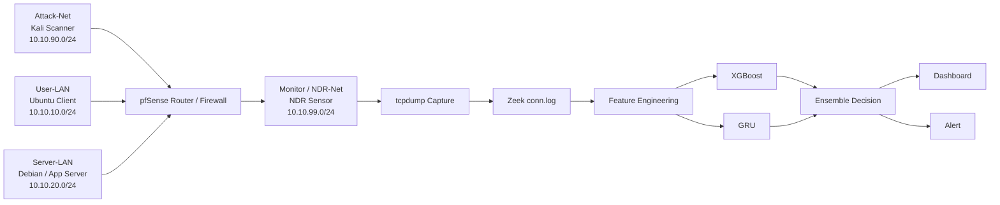

# AI 기반 네트워크 스캔 탐지 NDR 시스템

> VM Lab에서 수집한 네트워크 트래픽을 Zeek 로그로 변환하고, XGBoost와 GRU 기반 모델로 포트 스캔 및 low-and-slow scan을 탐지하는 실시간 NDR(Network Detection and Response) 프로젝트입니다.

[](#기술-스택)
[](#탐지-파이프라인)
[](#모델-설계)

## 프로젝트 개요

기존의 룰·임계값 기반 탐지는 짧은 시간에 다수의 연결을 만드는 일반적인 포트 스캔에는 효과적이지만, 연결을 긴 시간에 분산시키는 **low-and-slow scan**은 단일 시간 구간에서 정상 트래픽처럼 보일 수 있습니다. 이 프로젝트는 단일 window의 통계적 특징과 연속 window의 시계열 패턴을 함께 분석해 이 한계를 보완합니다.

| 항목 | 내용 |
| --- | --- |
| 프로젝트 | AI 기반 네트워크 스캔 탐지 NDR 시스템 |
| 기간 | 2026년 캡스톤디자인 |
| 팀 | 대전대학교 정보보안학과 캡스톤디자인 팀 디지털 혁명단 |
| 역할 | 팀장 · VM Lab 설계 · 데이터셋 구성 · Feature Engineering · AI 모델 개발 · 평가/발표 자료 구성 |
| 핵심 산출물 | 탐지 모델, 실시간 분석 파이프라인, NDR 대시보드, 상태 알림 |

포트폴리오에 바로 활용할 수 있는 요약은 [PORTFOLIO.md](PORTFOLIO.md)를 참고하세요.

## 해결하려는 문제

- 정상처럼 보이는 단일 window에서도 저속 스캔의 누적 패턴을 식별한다.
- Zeek `conn.log`의 flow 기반 특징으로 스캔 행위를 분류한다.
- 데이터 누수 없이 모델을 평가하고, Accuracy뿐 아니라 오탐(FPR)과 미탐(FNR)을 함께 관리한다.
- 오프라인 모델 평가에 그치지 않고 패킷 수집부터 대시보드·알림까지 연결한다.

## 아키텍처



## 탐지 파이프라인

```text
패킷 수집 → tcpdump → Zeek conn.log 변환 → flow/window feature 생성
→ XGBoost·GRU 추론 → ensemble score 계산
→ Normal / Warning / Scanning 판정 → Dashboard 표시 및 Alert 전송
```

1. `tcpdump`가 라우터 트래픽을 일정 단위로 수집합니다.
2. Zeek가 패킷을 `conn.log` 중심의 구조화된 네트워크 로그로 변환합니다.
3. window별 통계 특징과 rolling/sequence 특징을 생성합니다.
4. XGBoost와 GRU의 출력 확률을 결합해 탐지 상태를 정합니다.
5. 대시보드가 탐지 이벤트를 실시간으로 표시하고, Warning 또는 Scanning 전환 시 알림을 발생시킵니다.

## 데이터셋과 검증 설계

공개 데이터셋과 VM Lab 시뮬레이션 데이터를 통합했습니다. 정상 트래픽, 일반 스캔, low-and-slow scan을 함께 포함하고, 동일 session/run이 학습과 평가에 함께 들어가지 않도록 **session 단위 group split**을 적용했습니다.

| 항목 | 값 |
| --- | ---: |
| 전체 행 수 | 178,059 |
| 전체 열 수 | 107 |
| 모델 입력 feature | 90 |
| 정상 샘플 | 112,021 |
| 공격 샘플 | 66,038 |
| 레이블 | `normal` / `attack` |

원시 IP 주소 자체를 입력으로 사용하지 않고 접근 패턴을 통계화했습니다. 따라서 특정 IP나 특정 실행(run)에 모델이 과적합하는 위험을 줄이고, 새로운 환경에서의 일반화 가능성을 높이도록 설계했습니다.

## Feature Engineering

Zeek `conn.log`를 바탕으로 다음 특징을 구성했습니다.

| 범주 | 예시 |
| --- | --- |
| 트래픽 규모 | flow count, 평균 연결 지속 시간, bytes in/out |
| 목적지 다양성 | unique destination IP/port count |
| 연결 품질 | failure rate, connection state entropy |
| 프로토콜·서비스 | TCP/UDP/ICMP 비율, service entropy |
| 시간적 맥락 | rolling window statistics, sequence features |

일반 스캔은 짧은 시간 안에 목적지 포트·IP 수, flow 수, 실패율이 증가하는 경향이 있습니다. 반면 low-and-slow scan은 이러한 신호가 여러 window에 걸쳐 축적되므로, 단일 window 특징과 누적 특징을 함께 사용했습니다.

## 모델 설계

### XGBoost: 빠른 통계적 탐지

XGBoost는 단일 window의 tabular feature를 입력으로 사용합니다. 일반적인 포트 스캔을 빠르게 분류하고, feature importance로 판단 근거를 분석할 수 있어 실시간 파이프라인의 1차 탐지에 적합합니다.

### GRU: low-and-slow 시계열 보완

GRU는 연속 window의 변화 패턴을 입력으로 사용합니다. 단일 window에서는 약한 목적지 확산, 포트 접근, 실패율 변화를 시계열로 누적해 low-and-slow scan을 보완적으로 탐지합니다.

### Ensemble: 역할 분리형 최종 판단

```text
p_ensemble = 0.5 × p_xgboost + 0.5 × p_gru
```

두 모델을 단순한 주/보조 관계가 아닌 서로 다른 탐지 역할로 분리했습니다. 운영 시에는 XGBoost를 빠른 기본 탐지로 사용하고, 충분한 이력 데이터가 확보됐거나 low-and-slow 의심 구간에서는 GRU를 보완적으로 적용할 수 있습니다.

## 평가 기준

보안 탐지에서는 높은 Accuracy만으로 충분하지 않습니다. 정상 트래픽을 공격으로 오인하는 비용과 공격을 놓치는 비용을 함께 판단하기 위해 다음 지표를 사용합니다.

| 지표 | 확인 목적 |
| --- | --- |
| Precision / Recall / F1 | 공격 분류의 정확도와 탐지 범위 균형 |
| ROC-AUC / PR-AUC | 전체 분류 성능 및 불균형 데이터 성능 |
| FPR | 정상 트래픽 오탐률 |
| FNR | 공격 미탐률 |
| Low-and-slow Recall | 저속 스캔에 대한 별도 탐지 성능 |

현재 공개 저장소에는 원시 데이터와 학습된 모델 아티팩트를 포함하지 않습니다. 모델별 정량 지표는 재현 가능한 실험 산출물이 확정된 후 [`reports/`](reports/)에 추가할 예정입니다.

## 빠른 실행

### 사전 요구 사항

- Linux 환경의 Python 3.10 이상
- Zeek 및 tcpdump
- 학습된 XGBoost/GRU 아티팩트 (`runtime/models/`에 별도 배치)
- 라우터 SSH 접근 및 캡처 대상 인터페이스

### 1. 대시보드 실행

```bash
cd dashboard
cp config.example.json config.json
python3 -m dashboard_server.app -c config.json
```

### 2. 정상 트래픽 workload 실행

```bash
cd lab-services/ubuntu-workload-client
cp config.example.json config.json
./scripts/install_client.sh
ubuntu-workload-client -c config.json loop
```

### 3. 실시간 탐지 파이프라인 실행

환경에 맞게 IP, 인터페이스, SSH 별칭을 조정합니다.

```bash
cd runtime

./scripts/run_realtime_router_pipeline.sh \
  --router-ssh ndr-router \
  --router-interface em2 \
  --capture-filter "(host 10.10.10.10 or host 10.10.90.10) and net 10.10.20.0/24" \
  --dynamic-src-ip \
  --target-network "10.10.20.0/24" \
  --dashboard-url "http://127.0.0.1:8000" \
  --chunk-seconds 60 \
  --window-seconds 10 \
  --include-raw
```

## 저장소 구성

```text
.
├── model/          # 학습, 평가, feature engineering, inference
├── runtime/        # 캡처, Zeek 변환, 실시간 추론, ensemble
├── dashboard/      # SQLite·SSE 기반 대시보드
├── lab-services/   # 정상 트래픽 생성을 위한 데모 서비스와 client
├── reports/        # 데이터셋/모델 평가/실험 요약
└── PORTFOLIO.md    # 포트폴리오 첨부용 프로젝트 요약
```

## 공개 범위와 보안

포트폴리오용 공개 저장소에는 다음 자료를 의도적으로 포함하지 않습니다.

- 원시 데이터셋과 패킷 캡처 파일 (`data/`, `datasets/`, `*.pcap`)
- 생성된 데이터베이스와 로컬 런타임 로그 (`*.sqlite3`, 로그 파일)
- 학습된 모델 아티팩트 (`*.pt`, `*.joblib`)
- 실제 운영 설정과 비밀 정보 (`config.json`, `.env`)

모델 아티팩트는 GitHub Releases, Git LFS 또는 별도 아티팩트 저장소로 배포할 수 있습니다.

## 한계와 다음 단계

- VM Lab 기반 결과이므로 실제 기업망의 복잡한 정상 트래픽에 대한 추가 검증이 필요합니다.
- lateral movement, brute force, C2 통신 등으로 탐지 범위를 확장할 수 있습니다.
- threshold 자동 튜닝, 모델 drift 감지, ONNX 기반 경량화, 탐지 근거 설명 기능을 후속 과제로 둡니다.

## 기술 스택

| 구분 | 기술 |
| --- | --- |
| Language | Python |
| ML | XGBoost, GRU, LSTM, scikit-learn |
| Network Analysis | Zeek, tcpdump |
| Infrastructure | VMware, pfSense, Docker |
| Backend / Data | FastAPI, SQLite |
| Dashboard | HTML/CSS/JavaScript, Server-Sent Events |
| OS | Ubuntu, Debian, Kali Linux |

## Keywords

`Network Security` `NDR` `AI Security` `Zeek` `XGBoost` `GRU` `Low-and-Slow Scan` `Feature Engineering` `VM Lab` `Real-time Detection`

