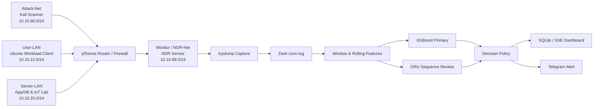

# AI 기반 네트워크 스캔 탐지 NDR 시스템

> VM Lab의 네트워크 트래픽을 Zeek flow 로그로 변환하고, XGBoost와 GRU를 활용해 포트 스캔 및 low-and-slow scan을 분석하는 실시간 NDR(Network Detection and Response) 프로젝트입니다.

[](#기술-스택)
[](#실시간-탐지-파이프라인)
[](#모델-운영-정책)

## 프로젝트 개요

단순 임계값 기반 탐지는 짧은 시간에 다수의 연결을 만드는 일반 스캔에는 효과적이지만, 연결을 여러 시간 구간에 분산시키는 **low-and-slow scan**은 정상 트래픽처럼 보일 수 있습니다. 이 프로젝트는 단일 window의 통계 특징과 연속 window의 변화 패턴을 결합해 그 한계를 분석하고, 수집부터 대시보드·알림까지 이어지는 NDR 흐름을 구현합니다.

| 항목 | 내용 |
| --- | --- |
| 프로젝트 | AI 기반 네트워크 스캔 탐지 NDR 시스템 |
| 기간 | 2026년 캡스톤디자인 |
| 팀 | 대전대학교 정보보안학과 캡스톤디자인 팀 디지털 혁명단 |
| 역할 | 팀장 · VM Lab 설계 · 데이터셋 구성 · Feature Engineering · 모델 개발 · 평가/발표 자료 구성 |
| 핵심 산출물 | NDR 모델 번들, 실시간 분석 파이프라인, SQLite/SSE 대시보드, 알림 연동 |

포트폴리오용 상세 기술 문서는 [PORTFOLIO.md](PORTFOLIO.md)를 참고하세요.

## 아키텍처



## 실시간 탐지 파이프라인

```text
Router tcpdump → Zeek conn.log → 10초 window feature 생성
→ rolling low-and-slow feature 재계산 → XGBoost 추론
→ (6개 window 이후) GRU 시계열 검토 → 정책 적용
→ Normal / Warning / Scanning 이벤트 → Dashboard / Alert
```

`runtime/scripts/run_realtime_router_pipeline.sh`는 60초 단위로 캡처를 반복합니다. 각 청크를 Zeek 로그로 변환하고 현재 실행(run)의 누적 feature를 다시 계산합니다. GRU는 6개 window의 이력이 필요하므로, 처음 5개 window에는 XGBoost 결과만 사용합니다.

대시보드는 Sensor VM의 `POST /api/events`를 받아 SQLite에 저장하고 Server-Sent Events로 브라우저에 전달합니다. `scanning` 상태는 Telegram 알림과 source IP별 cooldown을 지원합니다.

## 데이터와 Feature Engineering

공개 데이터셋, 시뮬레이션, VM Lab 수집 데이터를 공통 스키마로 정규화했습니다. 결합 실험 데이터는 178,059 rows, 107 columns이며 90개 모델 feature를 사용합니다.

| 범주 | 예시 |
| --- | --- |
| 트래픽 규모 | flow count, 평균 연결 시간, bytes/packets |
| 목적지 다양성 | unique destination IP/port count |
| 연결 품질 | failure rate, connection-state entropy |
| 프로토콜/서비스 | TCP·UDP·ICMP 비율, service/port entropy |
| 시간적 맥락 | 6·12·30·60 window rolling statistics, low-and-slow score |

원시 source/destination IP는 모델 feature에서 제외했습니다. 또한 동일 session/run에서 생성된 유사 샘플이 학습과 평가에 함께 포함되지 않도록 session 또는 run 단위 group split을 적용했습니다.

## 모델 운영 정책

XGBoost와 GRU를 무조건 동일 비중으로 자동 앙상블하지 않습니다. 현재 정책은 **XGBoost를 기본 판정 모델**로 두고, GRU는 XGBoost가 정상으로 판단한 구간에서 low-and-slow feature gate를 통과한 불일치를 **검토/트리아지 신호**로 제공합니다.

이 정책은 run-blocked·scenario-time-blocked 검증에서 단순 OR/자동 앙상블이 precision을 저하시킨 결과를 반영한 것입니다. GRU-only 공격 판정은 더 많은 실제 데이터 검증 전까지 자동 승격하지 않습니다.

| 구성 요소 | 역할 |
| --- | --- |
| XGBoost | 단일 window의 tabular feature를 빠르게 판정하는 기본 모델 |
| GRU | 연속 window의 변화 패턴을 확인하는 sequence challenger |
| low-slow gate | XGBoost/GRU 불일치 중 누적 스캔 신호가 있는 건만 검토 대상으로 제한 |
| soft vote bundle | 실험·런타임 통합용 비교 아티팩트이며 기본 자동 운영 정책과 구분 |

## 검증 결과와 해석

### Low-and-slow feature 검증

90개 feature, rolling windows `[6, 12, 30, 60]` 조건의 scenario-time-blocked 검증에서, `low_slow_v2`는 기존 v1 대비 false negative를 **28건에서 1건**, false positive를 **314건에서 4건**으로 줄였습니다. 다만 미래 test block에 해당 공격군이 학습/검증에 전혀 없으면 성능을 보장할 수 없으므로, 운영 전 시나리오별 미래 holdout을 별도로 둡니다.

### Combined-10 오프라인 비교

아래 결과는 64,908개의 동일한 aligned tail-window test rows에서 얻은 **실험 비교값**입니다. 여러 공개/시뮬레이션 데이터가 섞인 cross-domain 연구 결과이므로 VM Lab 운영 성능으로 일반화하지 않습니다.

| 모델 | Accuracy | Precision | Recall | F1 | FPR |
| --- | ---: | ---: | ---: | ---: | ---: |
| XGBoost | 94.17% | 99.93% | 91.25% | 95.39% | 0.12% |
| GRU | 58.39% | 99.87% | 37.12% | 54.12% | 0.09% |
| Soft-vote XGBoost+GRU | 97.50% | 99.77% | 96.44% | 98.07% | 0.44% |

### Controlled Lab Bundle

별도 real-only run-group CV(1,025 rows, 70 groups)로 내보낸 XGBoost 모델 번들은 feature schema, identity/leakage feature 부재, group overlap 부재, Precision 1.0000, Recall 0.9947, F1 0.9974, FPR 0을 통과했습니다. 이는 **통제된 실험 환경의 readiness gate**이며, 기업망 수준의 운영 성능 주장이 아닙니다.

## 빠른 실행

### 사전 요구 사항

- Linux의 Python 3.10 이상, Zeek, tcpdump
- 학습된 모델 아티팩트가 있는 `runtime/models/`
- 라우터 SSH 접근과 캡처 대상 인터페이스

### 1. 대시보드 실행

```bash
cd dashboard
cp config.example.json config.json
python3 -m dashboard_server.app -c config.json
```

### 2. 정상 workload 실행

```bash
cd lab-services/ubuntu-workload-client
cp config.example.json config.json
./scripts/install_client.sh
ubuntu-workload-client -c config.json loop
```

### 3. 실시간 분석 실행

```bash
cd runtime
./scripts/run_realtime_router_pipeline.sh \
  --router-interface em2 \
  --capture-filter "(host 10.10.10.10 or host 10.10.90.10) and net 10.10.20.0/24" \
  --dynamic-src-ip \
  --target-network "10.10.20.0/24" \
  --dashboard-url "http://127.0.0.1:8000" \
  --chunk-seconds 60 \
  --window-seconds 10 \
  --include-raw
```

## 저장소 구성

```text
.
├── model/          # 모델 학습, 평가, feature engineering, inference
├── runtime/        # 캡처, Zeek 변환, 실시간 추론, 정책 적용
├── dashboard/      # SQLite/SSE 대시보드와 알림
├── lab-services/   # 정상 baseline 트래픽을 만드는 서비스와 client
├── reports/        # 모델/데이터셋/실험 보고서
└── PORTFOLIO.md    # 포트폴리오 첨부용 상세 요약
```

## 공개 범위와 한계

원시 PCAP·데이터셋·실제 설정·비밀 값·학습 모델은 공개 저장소에서 제외합니다. 공개 데이터 성능은 cross-domain 참고값이며, 합성 데이터는 final real-only 성능을 부풀리는 데 사용하지 않습니다. 실제 기업망에서 사용하려면 정상 트래픽 확대 수집, 미래 시점 holdout 검증, 모델 drift 감지, 경보 정책 튜닝이 필요합니다.

## 기술 스택

| 구분 | 기술 |
| --- | --- |
| Language / ML | Python, XGBoost, GRU, LSTM, scikit-learn |
| Network | Zeek, tcpdump, pfSense, Nmap |
| Infrastructure | VMware, Docker, Ubuntu, Debian, Kali Linux |
| Serving | FastAPI, SQLite, Server-Sent Events, Telegram |

`Network Security` `NDR` `Zeek` `XGBoost` `GRU` `Low-and-Slow Scan` `Feature Engineering` `Real-time Detection`

